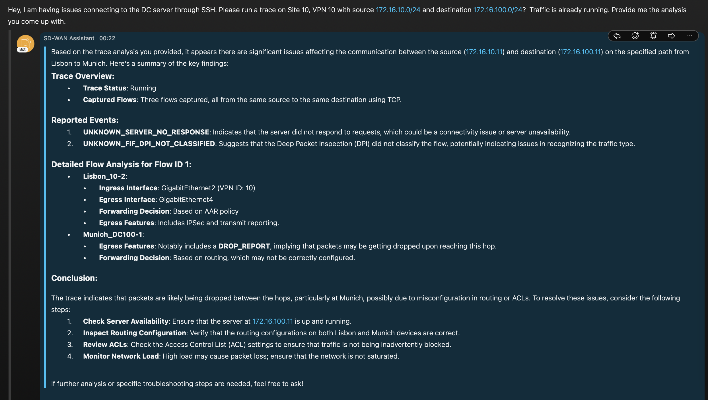

## SD-WAN AI Assistant with LangGraph
The purpose of this project is to explore LangGraph multi agent workflows to enhance my [previously created](https://github.com/aruiz-p/sdwan-assistant) sd-wan assistant. 

This repo was created along with the following <a href="https://netwithalex.blog/improving-my-sd-wan-assistant-multiple-agents/"> blog post </a>

### Built With

* [![Python][python.io]][python-url]
* [![LangChain][langchain.io]][langchain-url]
* [![Webex][webex.io]][webex-url]
* [![FastApi][fastapi.io]][fastapi-url]
  
### Prerequisites

The compponents used are:

* Cisco SD-WAN enviornment with 20.12.2/17.9.4a.  
* Webex account to build and register your bot. If you don't have it go to <https://developer.webex.com/docs/bots>.
* OpenAI account. Agent doesn't consume much credits. For more info <https://openai.com/index/openai-api/>.
* FastAPI to host the LLM 
* [Webex_bot](https://github.com/fbradyirl/webex_bot) to chat with the LLM.
* LangSmith. To create and account and get an API key go [here](https://docs.smith.langchain.com/how_to_guides/setup/create_account_api_key)

Create an .env file with the following information

### Preparing the enviornment

Create an .env file with the following enviornment variables

```bash
WEBEX_TEAMS_ACCESS_TOKEN="<YOUR_WEBEX_TEAMS_ACCESS_TOKEN>"
OPENAI_API_KEY="<YOUR_OPENAI_API_KEY>"
WEBEX_EMAIL="<YOUR_WEBEX_EMAIL>"
WEBEX_APPROVED_USERS_MAIL="<YOUR_WEBEX_APPROVED_USERS_MAIL>"
VMANAGE_USER="<YOUR_VMANAGE_USER>"
VMANAGE_PASS="<YOUR_VMANAGE_PASS>"
VMANAGE_IP="<YOUR_VMANAGE_IP>"
VMANAGE_PORT="<YOUR_VMANAGE_PORT>"
LANGCHAIN_TRACING_V2=true
LANGCHAIN_ENDPOINT="https://api.smith.langchain.com"
LANGCHAIN_API_KEY="<API_KEY>"
LANGCHAIN_PROJECT="<PROJECT_NAME>"
```

### Demo
In this demo, the goal is to understand how a multi-agent deployment works. 

I have configured and ACL on the DC's WAN Edge to drop the packets, I want to see if I am able to detect this problem using the SD-WAN Assistant.


To get more details you can check this <a href="https://netwithalex.blog/improving-my-sd-wan-assistant-multiple-agents"> blog post </a>


<!-- CONTACT -->
## Contact

[![Linkedin][linkedin-shield]][linkedin-url]

![Gmail][gmail-shield] - netwithalex@gmail.com


<!-- MARKDOWN LINKS & IMAGES -->
<!-- https://www.markdownguide.org/basic-syntax/#reference-style-links -->

[python.io]: https://img.shields.io/badge/Python-3776AB?style=for-the-badge&logo=python&logoColor=ffdd54
[python-url]: https://www.python.org/
[webex.io]: https://img.shields.io/badge/Webex-000000?style=for-the-badge&logo=Webex&logoColor=2d62f6
[webex-url]: https://www.webex.com/
[fastapi.io]: https://img.shields.io/badge/FastApi-000000?style=for-the-badge&logo=FastApi
[fastapi-url]: https://fastapi.tiangolo.com/
[langchain.io]: https://img.shields.io/badge/langchain-1C3C3C?style=for-the-badge&logo=langchain
[langchain-url]: https://www.langchain.com/
[linkedin-shield]: https://img.shields.io/badge/Linkedin-0077B5?style=for-the-badge&logo=linkedin
[linkedin-url]: https://www.linkedin.com/in/alejandro-ruiz-s-6080a413b
[gmail-shield]: https://img.shields.io/badge/Gmail-FFFFFF?style=for-the-badge&logo=Gmail
[gmail-url]: netwithalex@gmail.com
